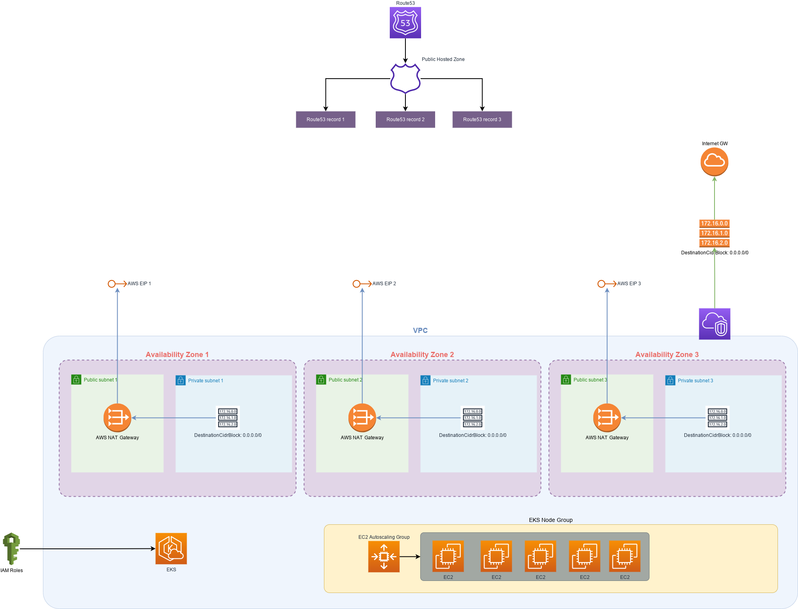
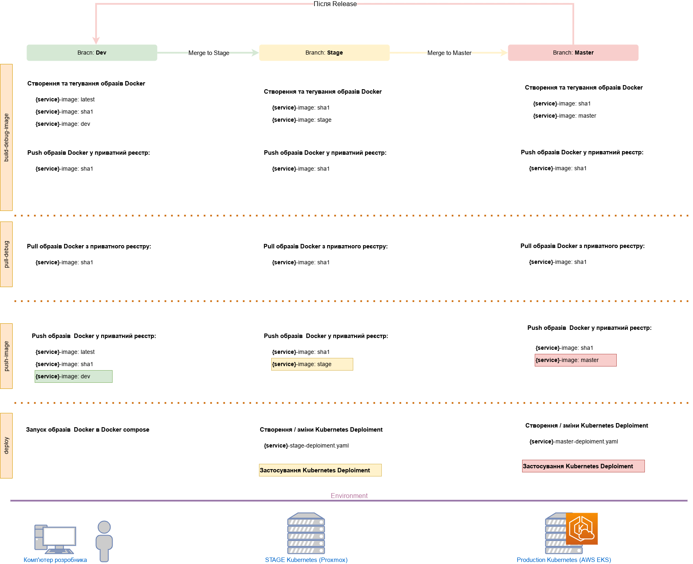

<!-- START doctoc generated TOC please keep comment here to allow auto update -->
<!-- DON'T EDIT THIS SECTION, INSTEAD RE-RUN doctoc TO UPDATE -->

# Документація по Проєкту

- [Мета Проєкту](#%D0%9C%D0%B5%D1%82%D0%B0-%D0%BF%D1%80%D0%BE%D0%B5%D0%BA%D1%82%D1%83)
- [Подальші плани](#%D0%9F%D0%BE%D0%B4%D0%B0%D0%BB%D1%8C%D1%88%D1%96-%D0%BF%D0%BB%D0%B0%D0%BD%D0%B8)
- [TODO](#todo)
- [Структура директорій](#%D0%A1%D1%82%D1%80%D1%83%D0%BA%D1%82%D1%83%D1%80%D0%B0-%D0%B4%D0%B8%D1%80%D0%B5%D0%BA%D1%82%D0%BE%D1%80%D1%96%D0%B9)
- [Вихідний код](#%D0%92%D0%B8%D1%85%D1%96%D0%B4%D0%BD%D0%B8%D0%B9-%D0%BA%D0%BE%D0%B4)
- [Програмні засоби](#%D0%9F%D1%80%D0%BE%D0%B3%D1%80%D0%B0%D0%BC%D0%BD%D1%96-%D0%B7%D0%B0%D1%81%D0%BE%D0%B1%D0%B8)
- [Модель процесу розробки](#%D0%9C%D0%BE%D0%B4%D0%B5%D0%BB%D1%8C-%D0%BF%D1%80%D0%BE%D1%86%D0%B5%D1%81%D1%83-%D1%80%D0%BE%D0%B7%D1%80%D0%BE%D0%B1%D0%BA%D0%B8)
- [Git Flow](#git-flow)
- [Середовище Dev](#%D0%A1%D0%B5%D1%80%D0%B5%D0%B4%D0%BE%D0%B2%D0%B8%D1%89%D0%B5-dev)
- [Середовище Stage](#%D0%A1%D0%B5%D1%80%D0%B5%D0%B4%D0%BE%D0%B2%D0%B8%D1%89%D0%B5-stage)
- [Середовище Production](#%D0%A1%D0%B5%D1%80%D0%B5%D0%B4%D0%BE%D0%B2%D0%B8%D1%89%D0%B5-production)
- [Опис CI/CD](#%D0%9E%D0%BF%D0%B8%D1%81-cicd)
    - [Основні завдання, які вирішуються за допомогою build pipeline.](#%D0%9E%D1%81%D0%BD%D0%BE%D0%B2%D0%BD%D1%96-%D0%B7%D0%B0%D0%B2%D0%B4%D0%B0%D0%BD%D0%BD%D1%8F-%D1%8F%D0%BA%D1%96-%D0%B2%D0%B8%D1%80%D1%96%D1%88%D1%83%D1%8E%D1%82%D1%8C%D1%81%D1%8F-%D0%B7%D0%B0-%D0%B4%D0%BE%D0%BF%D0%BE%D0%BC%D0%BE%D0%B3%D0%BE%D1%8E-build-pipeline)
    - [Змінні у Проєкті](#%D0%97%D0%BC%D1%96%D0%BD%D0%BD%D1%96-%D1%83-%D0%BF%D1%80%D0%BE%D0%B5%D0%BA%D1%82%D1%96)
    - [Опис змінних у Gitlab CI/CD](#%D0%9E%D0%BF%D0%B8%D1%81-%D0%B7%D0%BC%D1%96%D0%BD%D0%BD%D0%B8%D1%85-%D1%83-gitlab-cicd)
    - [Опис змінних у ./templates/ci-template.yaml.j2](#%D0%9E%D0%BF%D0%B8%D1%81-%D0%B7%D0%BC%D1%96%D0%BD%D0%BD%D0%B8%D1%85-%D1%83-templatesci-templateyamlj2)
    - [Опис змінних у ./templates/deploy-template.yaml.j2](#%D0%9E%D0%BF%D0%B8%D1%81-%D0%B7%D0%BC%D1%96%D0%BD%D0%BD%D0%B8%D1%85-%D1%83-templatesdeploy-templateyamlj2)
    - [Як працює процес Ci/CD](#%D0%AF%D0%BA-%D0%BF%D1%80%D0%B0%D1%86%D1%8E%D1%94-%D0%BF%D1%80%D0%BE%D1%86%D0%B5%D1%81-cicd)
        - [Гілка Dev](#%D0%93%D1%96%D0%BB%D0%BA%D0%B0-dev)
        - [Гілка Stage](#%D0%93%D1%96%D0%BB%D0%BA%D0%B0-stage)
        - [Гілка Master](#%D0%93%D1%96%D0%BB%D0%BA%D0%B0-master)
    - [Структура .gitlab-ci.yml](#%D0%A1%D1%82%D1%80%D1%83%D0%BA%D1%82%D1%83%D1%80%D0%B0-gitlab-ciyml)
        - [stages](#stages)
        - [include](#include)
        - [Основні складові ./ci/ci-{service}.yml](#%D0%9E%D1%81%D0%BD%D0%BE%D0%B2%D0%BD%D1%96-%D1%81%D0%BA%D0%BB%D0%B0%D0%B4%D0%BE%D0%B2%D1%96-cici-serviceyml)
- [Створення файлів конфігурацій та kubernetes deployment з шаблонів](#%D0%A1%D1%82%D0%B2%D0%BE%D1%80%D0%B5%D0%BD%D0%BD%D1%8F-%D1%84%D0%B0%D0%B9%D0%BB%D1%96%D0%B2-%D0%BA%D0%BE%D0%BD%D1%84%D1%96%D0%B3%D1%83%D1%80%D0%B0%D1%86%D1%96%D0%B9-%D1%82%D0%B0-kubernetes-deployment-%D0%B7-%D1%88%D0%B0%D0%B1%D0%BB%D0%BE%D0%BD%D1%96%D0%B2)
    - [Створення файлів для Gitlab CI](#%D0%A1%D1%82%D0%B2%D0%BE%D1%80%D0%B5%D0%BD%D0%BD%D1%8F-%D1%84%D0%B0%D0%B9%D0%BB%D1%96%D0%B2-%D0%B4%D0%BB%D1%8F-gitlab-ci)
    - [Створення файлів для Kubernetes Deployment і Service](#%D0%A1%D1%82%D0%B2%D0%BE%D1%80%D0%B5%D0%BD%D0%BD%D1%8F-%D1%84%D0%B0%D0%B9%D0%BB%D1%96%D0%B2-%D0%B4%D0%BB%D1%8F-kubernetes-deployment-%D1%96-service)
    - [Файли, які потрібно створювати та відстежувати самостійно](#%D0%A4%D0%B0%D0%B9%D0%BB%D0%B8-%D1%8F%D0%BA%D1%96-%D0%BF%D0%BE%D1%82%D1%80%D1%96%D0%B1%D0%BD%D0%BE-%D1%81%D1%82%D0%B2%D0%BE%D1%80%D1%8E%D0%B2%D0%B0%D1%82%D0%B8-%D1%82%D0%B0-%D0%B2%D1%96%D0%B4%D1%81%D1%82%D0%B5%D0%B6%D1%83%D0%B2%D0%B0%D1%82%D0%B8-%D1%81%D0%B0%D0%BC%D0%BE%D1%81%D1%82%D1%96%D0%B9%D0%BD%D0%BE)
- [Підключення Kubernetes кластеру до GitLab](#%D0%9F%D1%96%D0%B4%D0%BA%D0%BB%D1%8E%D1%87%D0%B5%D0%BD%D0%BD%D1%8F-kubernetes-%D0%BA%D0%BB%D0%B0%D1%81%D1%82%D0%B5%D1%80%D1%83-%D0%B4%D0%BE-gitlab)
- [Опис Ansible ролі `rancher-cluster`](#%D0%9E%D0%BF%D0%B8%D1%81-ansible-%D1%80%D0%BE%D0%BB%D1%96-rancher-cluster)
- [Ansible роль 'rancher-cluster'](#ansible-%D1%80%D0%BE%D0%BB%D1%8C-rancher-cluster)
    - [Actions:](#actions)
        - [./tasks/rancher-cluster.yml:](#tasksrancher-clusteryml)
        - [./tasks/rancher-control.yml:](#tasksrancher-controlyml)
        - [./tasks/rancher-nodes.yml:](#tasksrancher-nodesyml)
        - [./tasks/rancher-server.yml:](#tasksrancher-serveryml)
        - [./tasks/ubuntu20/base-packages.yml:](#tasksubuntu20base-packagesyml)
        - [./tasks/ubuntu20/docker.yml:](#tasksubuntu20dockeryml)
        - [./tasks/ubuntu20/hosts.yml:](#tasksubuntu20hostsyml)
        - [./tasks/ubuntu20/pip.yml:](#tasksubuntu20pipyml)
        - [./tasks/ubuntu20/rancher-dirs.yml:](#tasksubuntu20rancher-dirsyml)
        - [./tasks/ubuntu20/timesync.yml:](#tasksubuntu20timesyncyml)
        - [./tasks/ubuntu20/upgrade.yml:](#tasksubuntu20upgradeyml)
    - [Tags:](#tags)
    - [Variables:](#variables)
        - [Rancher-cluster:](#rancher-cluster)
    - [TODO:](#todo)
        - [./ubuntu20/docker.yml > `task - disable firewall (ufw)`:](#ubuntu20dockeryml--task---disable-firewall-ufw)
        - [./ubuntu20/upgrade.yml > `task - reboot node`:](#ubuntu20upgradeyml--task---reboot-node)
    - [Author Information](#author-information)
- [Приклад Inventory для ролі `rancher-cluster`](#%D0%9F%D1%80%D0%B8%D0%BA%D0%BB%D0%B0%D0%B4-inventory-%D0%B4%D0%BB%D1%8F-%D1%80%D0%BE%D0%BB%D1%96-rancher-cluster)
- [Опис ресурсів Terraform](#%D0%9E%D0%BF%D0%B8%D1%81-%D1%80%D0%B5%D1%81%D1%83%D1%80%D1%81%D1%96%D0%B2-terraform)
    - [Providers](#providers)
- [Як створювати та оновлювати документацію по Проєкту](#%D0%AF%D0%BA-%D1%81%D1%82%D0%B2%D0%BE%D1%80%D1%8E%D0%B2%D0%B0%D1%82%D0%B8-%D1%82%D0%B0-%D0%BE%D0%BD%D0%BE%D0%B2%D0%BB%D1%8E%D0%B2%D0%B0%D1%82%D0%B8-%D0%B4%D0%BE%D0%BA%D1%83%D0%BC%D0%B5%D0%BD%D1%82%D0%B0%D1%86%D1%96%D1%8E-%D0%BF%D0%BE-%D0%BF%D1%80%D0%BE%D0%B5%D0%BA%D1%82%D1%83)

<!-- END doctoc generated TOC please keep comment here to allow auto update -->

# Мета Проєкту

Мені, як Devops спеціалісту, було потрібно вдосконалити наступні навички:

- Вивчення підходів та інструментів для автоматичного створення документації по інфраструктурі. Максимально
  автоматизувати цей процес.

- Підібрати баланс кількість/якість/розуміння по тому як подавати інформацію про інфраструктуру та CI/CD

- Робота с Docker, збирання образів

- Робота з on-line сервісом GitLab:
    - GitLab CI/CD, gitlab-runner
    - GitLab private Docker registry
    - GitLab Terraform state files registry
    - інтегрування з кластерами Kubernetes

- Робота з Ansible

- Робота з Terraform

- Робота з хмарними сервісами AWS: EKS, Route53, VPC, IAM, ALB, EC2,

- Створення на базі *bare-metal* серверів та гіпервізору **Proxmox VE** інфраструктури для хостингу Kubernetes

# Подальші плани

- AWS Cloud Watch, AWS Cloud Trail

- Google Cloud Platform

- ELK Stack або Loki

- Istio Service Mesh

- Prometheus

- Grafana

- системи **documentation as code** на кшталт Hugo або Docuzaurus

- інтегрування Hashicorp Vault з Gitlab, Rancher, AWS EKS

- Jenkins, JenkinsX

- FluxCD

# TODO

- [ ] Додати в terraform `aws_acm_certificate` для https termination сабдоменів
- [ ] Рішення для Ingress EKS:
    - Nginx Ingress + External DNS
    - AWS Application Load Balancer
    - AWS Application Load Balancer + External DNS
- [ ] Додати в EKS Kubernetes Extentions
- [ ] Persistent Volume Claim в AWS EKS
- [ ] Створити в terraform декілька IAM з різним рівнем для декількох розробників
- [ ] Доробити CI/CD deploy на production

# Структура директорій

- `./src` – містить вихідні коди мікросервісів проєкт
- `./tools` – допоміжні застосунки для проєкту
    - Docker файли для утиліт, які можуть використовуватись на комп\`ютері розробника в docker compose
    - bash-скрипти для автоматичного парсінгу та створення
      документації - `ansible-autodoc`, `terraform-docs`, `merge-markdown`
    - рендерінг jinja2-templates за допомогою `jinja2-renderer`
- `./ci` – містить yaml-файли, які використовуються в `.gitlab-ci.yml`. Кожен файл відповідає за окремий сервіс. Всі
  файли мають однакову структуру та генеруються з шаблону
- `.gitlab` – містить налаштування для з\`єднання з кластерами
- `./img` – містить всі зображення, яки використовують в документації
- `./templates` – містить шаблони jinja2 для створення yaml-файлів для `.gitlab-ci.yml` та kubernetes deployment
- `./kubernetes` – містить згенеровані з шаблонів yaml-файли для kubernetes deployment
- `./docs` – містить конфігураційні файли для  `terraform-docs`, `merge-markdown` та для окремих файлів
  документації, які не генеруються автоматично
- `./ansible` – містить ansible-роль для створення кластера Kubernetes за допомогою [Rancher](https://www.rancher.com/)
- `./terraform` – містить ресурси Terraform для створення AWS EKS

# Вихідний код

Основою цього тестового Проєкту є досить вдалий код від Google (він дійсно
працює) — [Online Boutique](https://github.com/GoogleCloudPlatform/microservices-demo). Це "хмарний" веб-додаток для
електронної комерції, де користувачі можуть переглядати товари, додавати їх у кошик та купувати. Online Boutique
складається з 11 мікросервісів, які створені на різних мовах програмування.

| Мікросервіс                                                 | Мова програмування | Опис                                                                                                                                       |
|-------------------------------------------------------------|--------------------|--------------------------------------------------------------------------------------------------------------------------------------------|
| **frontend:**<br /> ./src/frontend                          | Go                 | HTTP-сервер для обслуговування веб-сайту. Не потребує реєстрації/входу та автоматично генерує ідентифікатори сеансу для всіх користувачів. |
| **cartservice:**<br />./src/cartservice                     | C#                 | Зберігає товари в кошику користувача в Redis і отримує їх.                                                                                 |
| **productcatalogservice:**<br />./src/productcatalogservice | Go                 | Надає список продуктів із файлу JSON і можливість пошуку продуктів і отримання окремих продуктів.                                          |
| **currencyservice:**<br />./src/currencyservice             | Node.js            | Конвертує одну грошову суму в іншу валюту. Використовує реальні значення, отримані від Європейського центрального банку.                   |
| **paymentservice:**<br />./src/paymentservice               | Node.js            | Стягує з указаної інформації кредитної картки (фіктивну) вказану суму та повертає ідентифікатор транзакції.                                |
| **shippingservice:**<br />./src/shippingservice             | Go                 | Дає оцінку вартості доставки на основі кошика для покупок. Відправляє товари за вказаною адресою (імітація)                                |
| **emailservice** – ./src/emailservice                       | Python             | Надсилає користувачам електронний лист із підтвердженням замовлення (макет).                                                               |
| **checkoutservice:**<br />./src/checkoutservice             | Go                 | Отримує кошик користувача, готує замовлення та організовує оплату, доставку та сповіщення електронною поштою.                              |
| **recommendationservice:**<br />./src/recommendationservice | Python             | Рекомендує інші продукти на основі того, що надано в кошику.                                                                               |
| **adservice:**<br />./src/adservice                         | Java               | Надає текстові оголошення на основі заданих контекстних слів.                                                                              |
| **loadgenerator:**<br />./src/loadgenerator                 | Python/Locust      | Постійно надсилає запити, що імітують реалістичні потоки покупок користувачів, до інтерфейсу.                                              |


# Програмні засоби

| Назва                  | Для чого використовувався                                                                                                                               |
|------------------------|---------------------------------------------------------------------------------------------------------------------------------------------------------|
| Docker, Docker Compose | Складання образів Docker, запуск декількох образів в одному робочому процесі                                                                            |
| Сервіс GitLab.com      | Хостинг програмного коду, хостинг приватного реєстру docker, deploy контейнерів в Kubernetes, хостинг Terraform state, Ci/CD з допомогою gitlab-runner  |
| Ansible                | Автоматичне розгортання **Rancher** на віртуальних машинах                                                                                              |
| Terraform              | Створення кластера EKS на AWS, та супутніх сервісів – Route53, ELB, KMS, VPC                                                                            |
| Proxmox VE             | Створення на bare-metal інфраструктури для Stage (UAT)                                                                                                  |
| Rancher (RKE1)         | Розгортання та адміністрування Kubernetes на віртуальних машинах. [Документація](https://rancher.com/docs/rke/latest/en/)                               |
| merge-markdown         | Автоматична компіляція html сайту, та Readme.md з документацією по всім розділам. [Документація](https://github.com/knennigtri/merge-markdown).         |
| ansible-autodoc        | Автоматичне створення документації з коментарів коду Ansible role. [Документація](https://github.com/AndresBott/ansible-autodoc)                        |
| terraform-docs         | Автоматичне створення документації з коментарів коду Terraform файлів. [Документація](https://terraform-docs.io/user-guide/introduction/)               |
| jinja2-render          | Створює файли за допомогою jinja2-templates. [Документація](https://github.com/pklaus/jinja2-render)                                                    |
| detect-secrets         | Шукає файли з sensitive content у файлах Проєкту. [Документація](https://github.com/Yelp/detect-secrets)                                                |
| pluralith              | Візуалізує інфраструктуру aws із файлу terraform.state ( не зовсім корисний але допомагає бачити масштаб ). [Документація](https://docs.pluralith.com/) |

# Модель процесу розробки

Структуру розробки можна поділити на три складові:

1. Програмний код, який супроводжується розробниками
2. Створення Docker-образів з програмного коду, хостинг образів в приватному реєстрі Docker
3. Запуск та оркестрування контейнерів на базі цих образів

Для ускладнення проєкту, програмний код всіх мікросервісів був об'єднаний в monorepo, у
вигляді `./src/{microservice-name}`

# Git Flow

Використовується схема [**gitlab-flow**](https://docs.gitlab.com/ee/topics/gitlab_flow.html):


1. **Dev** – основна гілка розробки.
2. **Stage** – гілка для тестування (UAT – User Acceptible Testing)
3. **Production** – гілка, на основі якої працює продуктивне середовище

# Середовище Dev

Розгортується на комп'ютері розробника. Складання образу відбувається в Docker за допомогою `gitlab-runner`. Він може
працювати на комп'ютері розробника, або на окремому сервері. Після складання образ публікується у приватному реєстрі на
GitLab. Йому призначаються теги -- `latest`, та git `short sha1`.

Це дозволяє використовувати образи, які складені іншими розробниками. Їх можна знаходити по схемі:

**№ завдання в Jira** ===> **№ у назві git-branch** ===> **git short-sha** ===> **docker-image: short-sha1**

Запуск та розгортання відбувається в `docker-compose.yml`. Спочатку там використовуються образи з тегом latest.

Треба додати  `docker-compose.yml` в `.gitignore`, та потім використовувати в ньому робочі
теги ( `latest` , `short sha1`).

# Середовище Stage

В моєму випадку використовувались 5 віртуальних машин: 2 ядра CPU, 4-8 Gb оперативної пам'яті, Ubuntu 20 LTS. Зовнішній
доступ — фіксований зовнішній IP, віртуальна машина з PFSense + Haproxy.

На базі **Rancher** був розгорнутий кластер Kubernetes з окремим `project`  та`namespace` для цього Проєкту. Також було
підключено приватний реєстр GitLab для образів Docker.

Зовнішній трафік був спрямований на **PFSense** + **Haproxy** з використанням Letsencrypt для SSL-termination, далі він
пересилався на `NodeIP` кластера Kubernetes


# Середовище Production



# Опис CI/CD

## Основні завдання, які вирішуються за допомогою build pipeline.

**1. Обробка змін в каталогах с вихідним кодом мікросервісів.**

Основний процес розробки. При змінах в певних каталогах `src/{project_name}/*` запускаються автоматичні дії:

1. Збирання образу Docker

2. После збирання,образу призначається "службовий" тег, який визначається у змінній `$DEBUG`:

```yaml
   DEBUG_TAG: $CI_REGISTRY/$CI_PROJECT_ROOT_NAMESPACE/$CI_PROJECT_NAME/$IMAGE_NAME:$CI_COMMIT_SHORT_SHA
```

3. Образ с тегом з пункту 2 завантажується в реєстр. Необхідно щоб було зафіксовано артифакт успішного збирання образу,
   якщо далі буде збій pipeline.

4. Завантаження із реєстру образа с тегом `$DEBUG`

5. Надання тегів `  DEV_TAG:` - тег для розробників, щоб вони завжди могли працювати з останньою
   версією –  `$CI_REGISTRY/$CI_PROJECT_ROOT_NAMESPACE/$CI_PROJECT_NAME/$IMAGE_NAME:latest`,
   тегу `BRANCH_TAG` - `$CI_REGISTRY/$CI_PROJECT_ROOT_NAMESPACE/$CI_PROJECT_NAME/$IMAGE_NAME:$CI_COMMIT_BRANCH` - тег
   гілки з якої відбувається build. Це зроблено з метою ілюстрації. Можна додавати теги по `git-tag`, `release` та ін.

5. Завантаження у реєстр образів с тегами з пункту 5

7. Зміна образа, який працює з відповідним `debpoiment` у кластерах `kubernetes`. Наприклад, для тестування, образ
   змінюється на тег `$DEBUG`.

**2. Мати гнучкі функції по збиранню образів Docker**

Повинна бути профілактика реєстру образів – видалення старих, безпекові тестування та інше. Але інколи для debug або для
усунення технічного боргу, потрібно мати старий образ, або образ якогось git-commit. Може виникнути ситуація, коли
потрібно мігрувати в інший приватний реєстр Docker образів. Для цього є функція автоматичного збирання образу якщо в
git commint є спеціальний текст.

Наприклад, щоб зібрати образ для мікросервісу `cartservice` потрібно в тексті опису git commit
вказати `cartservice-manual`  . Тоді буде автоматично збиратись відповідний образ по build workflow з першого розділу.

**3. Мати можливість автоматично робити Kubernetes Deployment у відповідний кластер **

Для всіх сервісів створені deployment в кластер kubernetes, які розташовані в
в` ./kubernetes/deploy-{envirinment_name}-{service_name}.yaml`.

> Тобто файл Kubernetes Deployment для мікросервісу  `cartservice` для середовища `stage` буде мати
> назву `deploy-stage-cartservice.yaml`

Якщо ці файли змінено, то за допомогою образу `bitnamy:kubectl` виконується оновлення deployment, що змінився. Або
створюється новий, якщо з\`являється новий файл.

## Змінні у Проєкті

Змінні, які не є частиною IaC-продуктів (Ansible, Terraform) використовуються у наступних файлах:

- **Gitlab CI** — на рівні Проєкту в панелі керування сервером, на рівні змінних у `.gitlab-cy.yml`. Ці змінні
  опрацьовуються **gitlab-runner**
- **./templates/ci-template.yaml.j2** — змінні, які використовуються `jinja2-render` при створенні шаблонів, з яких
  генеруються файли створення docker образів мікросервісів в `./ci/ci-{{service}}.yml`
- **./templates/deploy-template.yaml.j2** — змінні, які використовуються `jinja2-render` при створенні шаблонів, з яких
  генеруються файли kubernetes deployment для
  мікросервісів `./kubernetes/{service}-{git_branch_or_stage}-deploiment.yml`

## Опис змінних у Gitlab CI/CD

| Змінна                   | Опис                                                                                                                                            |
|--------------------------|-------------------------------------------------------------------------------------------------------------------------------------------------|
| `CI_REGISTRY_USER`       | Користувач приватного реєстру Docker Gitlab. Встановлюється як глобальна змінна групи або Проєкту в Gitlab                                      |
| `CI_REGISTRY_PASSWORD`   | Пароль користувача приватного реєстру Docker Gitlab. Встановлюється як глобальна змінна групи або Проєкту в Gitlab                              |
| `DEBUG_TAG`              | `$CI_REGISTRY`/`$CI_PROJECT_ROOT_NAMESPACE`/`$CI_PROJECT_NAME`/`$IMAGE_NAME`:`$CI_COMMIT_SHORT_SHA` - складений тег для образів з git-short-sha |
| ` BRANCH_TAG`            | `$CI_REGISTRY`/`$CI_PROJECT_ROOT_NAMESPACE`/`$CI_PROJECT_NAME`/`$IMAGE_NAME`:`$CI_COMMIT_BRANCH` - складений тег для образів з git-branch       |
| `DEV_TAG`                | `$CI_REGISTRY`/`$CI_PROJECT_ROOT_NAMESPACE`/`$CI_PROJECT_NAME`/`$IMAGE_NAME:latest`  - складений тег для образів з `latest`                     |
| `DEBUG_IMAGE`            | `$IMAGE_NAME`:`$CI_COMMIT_SHORT_SHA`                                                                                                            |
| `DOCKER_REGISTRY_URL`    | url Docker Hub або аналогів, використовувати, якщо не плануєте користуватись  приватним реєстром Docker Gitlab                                  |
| `DOCKER_REGISTRY_USER`   | login користувача у Docker Hub або аналог                                                                                                       |
| `DOCKER_REGISTRY_PASSWD` | пароль користувача Docker Hub або аналогів                                                                                                      |
| `BUILD_CONTEXT`          | `Docker WORKDIR` - відносно цієї директорії буде відбуватися складання образу Docker                                                            |
| `IMAGE_NAME`             | Назва образу мікросервісу                                                                                                                       |
| `KUBE_CONTEXT`           | `uri` зв'язку gitlab.com з кластером Kubernetes                                                                                                 |
| `PROJECT_NAMESPACE`      | Kubernetes namespace в якому будуть розгорнуті deployments мікросервисів                                                                        |
| `DEFAULT_IMAGE`          | Образ по замовчуванню, на базі якого gitlab-runner буде складати образи мікросервісів                                                           |

## Опис змінних у ./templates/ci-template.yaml.j2

| Змінна             | Опис                                                                                                                                                |
|--------------------|-----------------------------------------------------------------------------------------------------------------------------------------------------|
| `project_path`     | GitLab uri поточного Проєкту на сервері. Приклад: *gitlab.example.com/group-name/project-name*                                                      |
| `branch`           | Гілка git, в якої розробляються скрипти для деплою                                                                                                  |
| `service`          | Назва мікросервісу                                                                                                                                  |
| `build_context`    | `Docker WORKDIR` - відносно цієї директорії буде відбуватися складання образу Docker, дублюється за відповідною змінною в `BUILD_CONTEXT` GitLab Ci |
| `environment_name` | Назва оточення, на яке буде розгортатись deploy. Дублює змінну GitLab CI –`CI_ENVIRONMENT_NAME`                                                     |
| `environment_url`  | URL оточення, на яке буде розгортатись deploy. Дублює змінну GitLab CI –`CI_ENVIRONMENT_URL`                                                        |
| `autorules`        | Перелік директорій в Проєкті, в яких будуть відстежуватись зміни файлів для автоматичного збирання образів та deploy                                |

**Приклади використання змінних:**

Проєкт gitlab та git branch, з якого будуть включені файли `ci_docker_build.yml` та `ci_variables.yml`:

```yaml
include:
  - project: "{{ project_path }}"
    ref: "{{ branch }}"
    file:
      - ci/ci_docker_build.yml
      - ci/ci_variables.yml
```

Визначення GitLab `environment`:

```yaml
  environment:
    name: { { environment_name } }
    url: { { environment_url } }
```

Визначення правил для автоматичного збирання образів докер для сервісу:

```yaml
.{{ service }}_auto_rules:
  rules:
    - changes:
        { { autorules } }
      when: always
```

## Опис змінних у ./templates/deploy-template.yaml.j2

| Змінна                 | Опис                                                                                                                                                                                                                                                                     |
|------------------------|--------------------------------------------------------------------------------------------------------------------------------------------------------------------------------------------------------------------------------------------------------------------------|
| `deployment_name`      | Назва kubernetes deploymet, яка буде вказана в Cluster Control.  Бажано вказувати назву мікросервісу, або вказувати  зв\`язок з оточенням. Приклад: "deployment_name ": "stage-emailservice". Використовується в labels                                                  |
| `image_pull_secrets`   | Kubernetes Secret, який містить ідентіфікатори доступу до приватного реєстру docker образів                                                                                                                                                                              |
| `app_name`             | Назва мікросервісу. Приклад: "app_name": "emailservice".  Використовується в labels                                                                                                                                                                                      |
| `app_version`          | Версія або реліз мікросервісу. Бажано використовувати правила для [Semantic Versioning](https://semver.org/). Використовується в labels                                                                                                                                  |
| `project_name`         | Якщо використовується Rancher, назва Проєкту у Rancher. В Rancher до POD у межах Проєкту заборонений трафік POD за межами Проєкту. Це дає додаткову можливість захисту. !!! Проєкт не namespace. В межах Проєкту може буди декілько namespace. Використовується в labels |
| `namespace_name`       | namespace в який буде проводитись Kubernetes Deployment. Використовується в labels                                                                                                                                                                                       |
| `app_creator`          | email або інший контакт розробника. Використовується в labels                                                                                                                                                                                                            |
| `app_supporter`        | Відповідальний за support. mail або інший контакт. Використовується в labels                                                                                                                                                                                             |
| `environment_stage`    | Назва оточення, на яке буде розгортатись deploy. Дублює змінну GitLab CI –`CI_ENVIRONMENT_NAME`, та `environment_name` в ./templates/ci-template.yaml.j2. Використовується в labels                                                                                      |
| `environment_uri`      | URL оточення, на яке буде розгортатись deploy. Дублює змінну GitLab CI –`CI_ENVIRONMENT_URL`, та `environment_url` в ./templates/ci-template.yaml.j2. Використовується в labels                                                                                          |
| `app_component`        | Яку функцію виконує мікросервіс в загальному продукті. Використовується в labels. Приклад: "app_component": "email-campain"                                                                                                                                              |
| `business_domain`      | Показує зв\`язок між мікросервісом, та бізнес-функцією на яку він має вплив. Використовується в labels. Приклад: "business_domain": "marketing"                                                                                                                          |
| `business_owner`       | Контакт відділу або відповідального за  бізнес-функцію. Використовується в labels. Приклад: "business_owner": "marketing@company.com"                                                                                                                                    |
| `app_instance`         | На якій базі розгорнуто оточення для deploy. baremetal, rancher, eks. Використовується в labels. Приклад: "app_instance": "aws-eks"; "app_instance": "baremetal-rancher"; "app_instance": "ec2-kubespray"                                                                |
| `app_replicas`         | Кількість екземплярів мікросервісу, які мають працювати                                                                                                                                                                                                                  |
| `image`                | Повний URL образу Docker.  Приклад для Gitlab: registry.gitlab.com/{gitlab_group}/project/{service_name}:{tag}                                                                                                                                                           |
| `requests_memory`      | Скільки відводити оперативної пам\`яті (мінімум) для одного екземпляру контейнера                                                                                                                                                                                        |
| `requests_cpu`         | Скільки відводити cpu_millicores (мінімум) для одного екземпляру контейнера                                                                                                                                                                                              |
| `limits_memory`        | Скільки відводити оперативної пам\`яті (максимум) для одного екземпляру контейнера                                                                                                                                                                                       |
| `limits_cpu`           | Скільки відводити cpu_millicores (максимум) для одного екземпляру контейнера                                                                                                                                                                                             |
| `ports_container_port` | Порт, на якому POD приймає вхідний трафік                                                                                                                                                                                                                                |
| `port_name`            | Назва порту                                                                                                                                                                                                                                                              |
| `ports_protocol`       | Протокол, по якому працює POD в Kubernetes Deployment. TCP, UDP, SCTP                                                                                                                                                                                                    |
| `service_port`         | Порт, на який контейнер приймає вхідний трафік. Відноситься до Kubernetes Service                                                                                                                                                                                        |
| `service_protocol`     | Протокол, по якому працює Kubernetes Service. TCP, UDP, SCTP. Приклад: spec.ports.protocol: TCP. Відноситься до Kubernetes Service                                                                                                                                       |
| `service_target_port`  | Порт на який буде спрямовано трафік з `service_port`. Відноситься до Kubernetes Service                                                                                                                                                                                  |
| `service_ip_type`      | Яким чином  Kubernetes Service публікує порти — `ExternalName`, `ClusterIP`, `NodePort`, `LoadBalancer`.  Відноситься до Kubernetes Service                                                                                                                              |
| `app_env`              | Змінні для специфікації контейнеру                                                                                                                                                                                                                                       |

​

## Як працює процес Ci/CD



### Гілка Dev

> {service} — змінна, в яку підставляється назва мікросервісу (`./scr/{service}`)

Згідно схеми gitlab-flow — це основна робоча гілка. Після коміту автоматично буде створено образ Docker з відповідними
тегами:

- {service}-image:**latest** — основний робочий артефакт гілки **dev**. Використовується в `docker-compose.yml` на
  комп'ютері розробника. Для тестування власної розробки та останніх комітів мікросервісів колег
- {service}-image:**sha1** — використовується для зв'язку:  № Jira Task ===> № Jira Task у назві git-branch ===> git
  short-sha ===> {service}-image:**sha1**. Потрібен для debug, або для перевірки робочих гіпотез на
  локальному `docker-compose.yml`.
- {service}-image:**dev** — сінонім {service}-image:**latest**

Всі ці теги будуть завантажені у Docker Registry (Docker Hub або приватний)

### Гілка Stage

Гілка для тестів.

Створює образ з тегами:

- {service}-image:**sha1** — debug або Jira Task
- {service}-image:**stage** — артифакт, який буде автоматично викладено на середовище **stage** (Proxmox + Rancher) за
  допомогою ./kubernetes/{service}-**stage**-deploiment.yml

Всі ці теги будуть завантажені у Docker Registry (Docker Hub або приватний)

### Гілка Master

Гілка для робочого середовища.

Створює образ з тегами:

- {service}-image:**sha1** — debug або Jira Task
- {service}-image:**master** — артифакт, який буде автоматично викладено на середовище **production** (AWS EKS) за
  допомогою ./kubernetes/{service}-**master**-deploiment.yml

Всі ці теги будуть завантажені у Docker Registry (Docker Hub або приватний)

## Структура .gitlab-ci.yml

Головний файл стандартний — `./gitlab-ci.yml` у "корені" Проєкту. Він включає решту файлів, які підключаються за
допомогою директиви `include`.

> У сервісі gitlab.com у мене не вийшло підключати файли за допомогою (local), повідомлення linter — "file not found"
>
> ```yam
> include:
>   - local: '/templates/.gitlab-ci-template.yml'
> ```
>
> Тому довелося використовувати "hack":
>
> ```yaml
> include:
>   - project: "project_name"
>   	ref: "ci-template"
>   	file:
>       - ci/ci_docker_build.yml
>       - ci/ci_variables.yml
>       - ci/kubectl_handler.yml
> ```
>
> Де у якості `project_name` був цей Проєкт.


> Звісно, що є принята практика створювати окремий Проєкт для всій логіки CI/CD, та писати узагальнені скрипти. Але це
> занадто ускладнює учбовий Проєкт.
>
> Але для коректного використання оператору `include` потрібно вказувати параметр `ref:`.
>
> Тому всі зміні в скриптах GitLabCI, Kubernetes Deployment та інше потрібно виконувати в гілці `ci-template`.
>
> Звісно це не зовсім зручно, ало поки буде так.

Кожен сервіс має свій *"іменний"* CI/CD-файл `./ci/ci-{service}.yml` та свій Kubernetes
Deploiment `./kubernetes/{service}-stage-deploiment.yml`.

### stages

- build-debug-image — створюється образ docker, надається тег short-sha, образ завантажується в docker registry
- pull-debug — вивантаження з реєстру, надання інших тегів
- push-image — завантаження нових тегів в реєстр
- deploy — деплой в kubernetes cluster

### include

До Проєкту додані файли, які можна використовуваті в інших Проєктах.

`./ci/ci_docker_build.yml` — містить [hidden jobs](https://docs.gitlab.com/ee/ci/jobs/index.html#hide-jobs) по
створенню, тегуванню та завантаженню образів. Ці дії можна підключати за
допомогою [anchors](https://docs.gitlab.com/ee/ci/yaml/yaml_optimization.html#anchors)

`./ci/ci_variables.yml` — містить основні змінні, які підключаються до всіх ci-файлів.

Ці два файли підключаються в кожен `./ci/ci-{service}.yml`

### Основні складові ./ci/ci-{service}.yml

Система назви jobs:

- {{service}}_auto_rules — правила, по яким спрацьовує автоматичний build docker image
- {{service}}_manual_rules — правила, по яким спрацьовує ручний build docker image
- auto\_{{service}}\_debug — автоматичне створення и push docker image:sha1
- manual\_{{service}}\_debug — ручне створення и push docker image:sha1
- pull_auto\_{{service}}\_sha — pull образів docker з артефакту auto\_{{service}}\_debug
- pull_manual\_{{service}}\_sha — pull образів docker з manual\_{{service}}\_debug
- push_currencyservice_image — push образів docker з тегами latest, branch_name

Відстежування змін файлів у директоріях:

```yaml
.emailservice_auto_rules:
  rules:
    - changes:
        - src/{{service}}/**/**/*
      when: always
```

Відстежування тексу git commit:

```yaml
.emailservice_manual_rules:
  rules:
    - if: "$CI_COMMIT_MESSAGE =~ /emailservice-manual/"
      when: always
```

Завантаження образів docker в реєстр:

```yaml
push_{{ service }}_image:
  stage: push-image
  # Змінні
  variables:
    <<: *global_var
    IMAGE_NAME: { { service } }
  # Перевикористання jobs з умовами для завантаження образів
  extends:
    - .deploy_latest_tag_to_registry
    - .deploy_branch_tag_to_registry
  # Умиви, за яких відбувається завантаження образів
  rules:
    - !reference [ ".{{ service }}_auto_rules", "rules" ]
    - !reference [ ".{{ service }}_manual_rules", "rules" ]
  # Залежність від виконання попередніх jobs
  needs:
    - job: pull_manual_{{ service }}_sha
      optional: true
    - job: pull_auto_{{ service }}_sha
      optional: true
```

Завантаження образу за тегом `latest`, якщо назва git brabch дорівнює`dev`, для використання на комп\`ютері розробника
за допомогою docker compose:

```yaml
# Extnetd from ./ci/ci_docker_build.yml
.deploy_latest_tag_to_registry:
  stage: push-image
  script:
    - docker tag $DEBUG_TAG $DEV_TAG
    - docker push $DEV_TAG
  rules:
    - if: "$CI_COMMIT_BRANCH =~ /dev/"
      when: auto
  when: on_success
```

Завантаження образу з тегом branch_name, якщо назва git brach дорівнює `stage ` або `main`:

```yaml
# Extnetd from ./ci/ci_docker_build.yml
.deploy_branch_tag_to_registry:
  stage: push-image
  script:
    - docker tag  $DEBUG_TAG $BRANCH_TAG
    - docker push $BRANCH_TAG
  rules:
    - if: "$CI_COMMIT_BRANCH =~ /stage/ || $CI_COMMIT_BRANCH =~ /main/"
  when: on_success
```

# Створення файлів конфігурацій та kubernetes deployment з шаблонів

Кожен мікросервіс має свої конфігураційні файли:

1. **./ci/ci-{service}.yml** — GitLab CI файл для створення образів мікросервісів та розгортання їх у кластер Kubernetes
2. **./kubernetes/{service}-{environment}-deployment.yaml** — Kubernetes Deployment для мікросервісу для конкретного
   оточення (`stage`, `prod`)
3. **./kubernetes/{service}-{environment}-service.yaml** — Kubernetes Service для мікросервісу для конкретного
   оточення (`stage`, `prod`)

Всі ці файли створюються з jinja2 templates за допомогою python
скрипта [jinja2-render](https://github.com/pklaus/jinja2-render).

```bash
pip install jinja2-render
```

Застосування:

```bash
jinja2-render -c {файл контексту}  -f {шаблон з якого створюються файли} -o {віхідний файл} {пункт контексту}
```

файл контексту – json-файл в якому визначаються змінні та їх значення, які потім будуть застосовані в вихідних файлах.

шаблон з якого створюються файли – jinja2 шаблон, в якому застосовуються змінні

пункт контексту – першій рівень у списку в json

Приклад:

файлу контексту – *debpoy-prod-env.py*:

```json
CONTEXTS = {
  "adservice": {
    "deployment_name": "prod-adservice",
    "deployment_app": "adservice",
    "app_replicas": "1",
    "image": "registry.gitlab.com/devops1121/microservices-demo-google/adservice:stage",
    "image_pull_secrets": "registry.gitlab",
    "app_name": "adservice",
    "app_version": "0.1.0",
    "project_name": "microservices-demo",
    "namespace_name": "prod-microservices-demo",
    "app_creator": "developer_company.com",
    "app_supporter": "devops_company.com",
    "environment_stage": "prod",
    "environment_uri": "prod-env.company.com",
    "app_component": "advertise-service",
    "business_domain": "sales",
    "business_owner": "marketing_company.com",
    "app_instance": "baremetal-rancher",
    "requests_memory": "512Mi",
    "requests_cpu": "500m",
    "limits_memory": "1Gi",
    "limits_cpu": "1000m",
    "ports_container_port": "9555",
    "ports_protocol": "TCP",
    "port_name": "grpc",
    "service_port_name": "grpc",
    "service_port": "9555",
    "service_protocol": "TCP",
    "service_target_port": "9556",
    "service_ip_type": "ClusterIP",
    "app_env": "- name: PORT\n            value: \"9555\"\n          - name: \"DISABLE_STATS\"\n            value: \"1\"\n          - name: \"DISABLE_TRACING\"\n            value: \"1\"\n"
  },
  "cartservice": {
    "deployment_name": "prod-cartservice",
    "deployment_app": "cartservice",
    "app_replicas": "1",
    "image": "registry.gitlab.com/devops1121/microservices-demo-google/cartservice:stage",
    "image_pull_secrets": "registry.gitlab",
    "app_name": "cartservice",
    "app_version": "0.1.0",
    "project_name": "microservices-demo",
    "namespace_name": "prod-microservices-demo",
    "app_creator": "developer_company.com",
    "app_supporter": "devops_company.com",
    "environment_stage": "prod",
    "environment_uri": "prod-env.company.com",
    "app_component": "advertise-service",
    "business_domain": "sales",
    "business_owner": "marketing_company.com",
    "app_instance": "baremetal-rancher",
    "requests_memory": "512Mi",
    "requests_cpu": "500m",
    "limits_memory": "1Gi",
    "limits_cpu": "1000m",
    "ports_container_port": "7070",
    "ports_protocol": "TCP",
    "port_name": "grpc",
    "service_port_name": "web",
    "service_port": "7070",
    "service_protocol": "TCP",
    "service_target_port": "7070",
    "service_ip_type": "ClusterIP",
    "app_env": "- name: REDIS_ADDR\n            value: \"redis-cart:6379\"\n"
  }
}
```

Файл шаблону – *deploy-template.yaml.j2*

```jinja2
---
apiVersion: apps/v1
kind: Deployment
metadata:
  name: {{ deployment_name }}
  namespace: {{ namespace_name }}
  labels:
    deployment_name: {{ deployment_name }}
    app.kubernetes.io/name: {{ app_name }}
    app.kubernetes.io/version: "{{ app_version }}"
    project_name: {{ project_name }}
    namespace_name: {{ namespace_name }}
    app.kubernetes.io/created-by: {{ app_creator }}
    app.kubernetes.io/managed-by: {{ app_supporter }}
    environment_stage: {{ environment_stage }}
    environment_uri: {{ environment_uri }}
    app.kubernetes.io/component: {{ app_component }}
    business_domain: {{ business_domain }}
    business_owner: {{ business_owner}}
    app.kubernetes.io/instance: {{ app_instance }}

spec:
  replicas: {{ app_replicas }}
  strategy:
    type: RollingUpdate
    rollingUpdate:
      maxSurge: 25%
      maxUnavailable: 25%
  template:
    metadata:
      name: {{ deployment_name }}
      namespace: {{ namespace_name }}
      labels:
        deployment_name: {{ deployment_name }}
        deployment_app: {{ deployment_app }}
        app.kubernetes.io/name: {{ app_name }}
        app.kubernetes.io/version: "{{ app_version }}"
        project_name: {{ project_name }}
        namespace_name: {{ namespace_name }}
    spec:
      containers:
        - name: {{ deployment_name }}
          image: {{ image }}
          imagePullPolicy: Always
          resources:
            requests:
              memory: {{ requests_memory }}
              cpu: {{ requests_cpu }}
            limits:
              memory: {{ limits_memory }}
              cpu: {{ limits_cpu }}
          ports:
            - containerPort: {{ ports_container_port }}
              protocol: {{ ports_protocol }}
              name: {{port_name}}
          env:
          {{app_env}}
      restartPolicy: Always
      imagePullSecrets:
        - name: {{ image_pull_secrets }}
  selector:
    matchLabels:
      deployment_app: {{ deployment_app }}
      namespace_name: {{ namespace_name }}
      environment_stage: {{ environment_stage }}
```

Створити Kubernetes deployment для adservice:

```bash
jinja2-render -c ./debpoy-prod-env.py  -f ./deploy-template.yaml.j2 -o ./adservice-prod-deploy.yaml adservice
```

Створити Kubernetes deployment для cartservice:

```bash
jinja2-render -c ./debpoy-prod-env.py  -f ./deploy-template.yaml.j2 -o ./cartservice-prod-deploy.yaml cartservice
```

## Створення файлів для Gitlab CI

- файл контексту для Gitlab CI — ./templates/ci-env.py
- шаблон з якого створюються файли Gitlab CI — ./templates/ci-template.yaml.j2
- вихідні файли — ./ci/ci_{service}.yml
- bash скрипт, який автоматично створює файли для всіх сервісів в ./src/ — ./tools/ci-template.sh

## Створення файлів для Kubernetes Deployment і Service

- файл контексту для Kubernetes Deployment — ./templates/debpoy-stage-env.py (оточення `stage`),
  ./templates/debpoy-prod-env.py (оточення `prod`)

- шаблон з якого створюються файли Kubernetes Deployment — ./templates/deploy-template.yaml.j2

- вихідні файли — ./kubernetes/{service}-{environment}-deployment.yaml

- bash скрипт, який автоматично створює файли для всіх сервісів в ./src/ — ./tools/kube-deploy-template.sh
  Застосування:

  ```bash
  ./kube-deploy-template.sh prod або ./kube-deploy-template.sh stage
  ```

> Скрипт використовує результат команди `ls ./src` як перелік значень для створення відповідних файлів. Тобто, якщо є
> каталог сервіса `adservice`, то повинен бути відповідний контекст у файлі контексту.

## Файли, які потрібно створювати та відстежувати самостійно

У адмініструванні Kubernetes можуть бути різні ситуації, коли потрібно створювати та зміновати різні об\`єкті
Kubernetes. Ці віпадки важко продумати заздалегідь та створити відповідні jinja2 templates. Тому решту файлів для об\`
єктів Kubernetes потрібно створювати самойстійно у форматі:

./kubernetes/{service}-{environment}-{kubernetes-resource}.yaml.

Зміни у диркторії ./kubernetes/ обпрацьовуються автоматично GitLabCI pipeline

# Підключення Kubernetes кластеру до GitLab

`gitlab-agent ` інтегрує Gitlab с кластером Kubernetes. Працює навіть за NAT.  
Потрібно створити порожній файл в `.gitlab/agents/{agent-name}/config.yaml`  
Потім зареєструвати агента в GitLab:

1. **Infrastructure** ==> **Kubernetes clusters** ==> **Create agent**
2. Ввести `{agent-name}` та отримати токен - `{cluster-token}`
3. В кластері:
    ```bash
    helm repo add gitlab https://charts.gitlab.io
    helm repo update
    helm upgrade --install `{agent-name}` gitlab/gitlab-agent \
    --namespace gitlab-agent-`{agent-name}` \
    --create-namespace \
    --set image.tag=v15.9.0-rc1 \
    --set config.token=`{cluster-token}` \
    --set config.kasAddress=wss://kas.gitlab.com
    ```

Це нам каже офіційна документація.

Але в мене в Rancher запрацювало якщо додати HELM репозіторій та додади агента за допомогою yaml:

```yaml
affinity: { }
config:
  kasAddress: wss://kas.gitlab.com
  token: `{ cluster-token }`
extraEnv: [ ]
fullnameOverride: ''
image:
  pullPolicy: IfNotPresent
  repository: registry.gitlab.com/gitlab-org/cluster-integration/gitlab-agent/agentk
  tag: 'v15.2.0'
imagePullSecrets: [ ]
nameOverride: ''
nodeSelector: { }
podAnnotations:
  prometheus.io/path: /metrics
  prometheus.io/port: '8080'
  prometheus.io/scrape: 'true'
rbac:
  create: true
resources: { }
serviceAccount:
  annotations: { }
  create: true
tolerations: [ ]

```

Агент може працювати в двох режимах:

- [GitOps workflow](https://docs.gitlab.com/ee/user/clusters/agent/gitops.html) - GitLab agent в кластері періодично
  відстежує зміни у віхідному коді Kubernetes Deployment, та робить **pull** з репозіторію Проєкту
- [GitLab CI/CD workflow](https://docs.gitlab.com/ee/user/clusters/agent/ci_cd_workflow.html) - за допомогою `kubectl `
  pipeline **push** зміни у віхідному коді Kubernetes Deployment у кластер

Якщо використовувати **GitLab CI/CD workflow**, то файл `.gitlab/agents/{agent-name}/config.yaml` повинен мати такий
вигляд:

```yaml
ci_access:
  projects:
    - id: path/to/project
```

# Опис Ansible ролі `rancher-cluster`

Для встановлення Kubernetes використовується RKE1 (Rancher Kubernetes Engine v.1)
від [Rancher Labs](https://www.rancher.com/products/rke).

> RKE — це дистрибутив Kubernetes, сертифікований CNCF, якій повністю працює в контейнерах Docker

В ролі використовуються 5 віртуальних машин (нод):

- **1** Rancher Server — на неї встановлюється первинний набір ПЗ та нода для кластера `etcd`
- **2** Control Plane
  Node — `kube-apiserver`,`etcd`, `cloud controller manager`, `kube-controller manager`, `kube-sheduler`
- **2** Worker Node — `kubelet`, `kubeproxy`

В інфраструктурі використовується ProxmoxVE KVM з Ubuntu 20.04 (LTS)

Оскільки Rancher Kubernetes Engine ще "молодий" продукт — ще не все добре працює, тому рекомендовано використовувати
саме ті версії системного ПЗ, які 100% працюють в цій ролі:

```yaml
- rancher_image: rancher:v2.6.6
- rancher_agent_image: rancher-agent:v2.6.6
- ansible_distribution: ubuntu
- ansible_distribution_release: focal
- rancher_k8s_version: 1.20.15
- docker: 5:20.10.12~3-0~ubuntu-focal
```

# Ansible роль 'rancher-cluster'

Роль створена для автоматичного встановлення кластера kubernetes для навчання та експериментів.

## Actions:

Actions performed by this role

#### ./tasks/rancher-cluster.yml:

* Імпортує `rancher_api_key` з "віртуального" хоста. Створює Kubernetes кластер зі значеннями
  змінних `rancher_k8s_version` та `rancher_cluster_name`. Генерує bearer token для реєстрації
  нод - `rancher_registration_token`, посилання для реєстрації нод - `rancher_registration_link`, команду для реєстрації
  нод - `rancher_node_register`, до якої буде додаватись змінна `rancher_role_flags`, в залежності від ролі ноди в
  кластері. Всі ці змінні експортуються через "віртуальні" хости для інших задач. (rancher-cluster)

#### ./tasks/rancher-control.yml:

* Очікує три хвилини щоб кластер повністю розгорнувся, імпортує значення змінної `export_node_start` з віртуального
  хоста, додає `Control Plane` ноду до кластера. Задача виконується тільки на нодах де в
  inventory `rancher_node_role: "control"` (rancher-cluster)

#### ./tasks/rancher-nodes.yml:

* Очікує 5 хвилин щоб кластер та `Control Plane` ноди повністю розгорнулися, імпортує значення
  змінної `export_node_start` з віртуального хоста, додає `Worker Node` до кластера. Задача виконується тільки на нодах
  де в inventory `rancher_node_role: "node"` (rancher-cluster)

#### ./tasks/rancher-server.yml:

* Запускає на ноді з `rancher_node_role: "server"` контейнер `ranсher-server`, який запускає процес інсталювання, та
  приймає з\'єднання на портах 80,443. На ці операції відведено 3 хвилини (в залежності від "заліза" можна вказати свої
  параметри). Потім за допомогою `curl` здійснюються 3 спроби логину на сервер - це "хак", бо Rancher незрозуміло
  поводить себе с токенами, дуже часто їх змінює. Експерименти показали, що з третьої спроби логін на сервер працює без
  помилок. Також все запрацювало тільки після заміни `ansible.builtin.command` на `ansible.builtin.shell` в завданнях.
  Результат сесії логіну - це json, з якого за допомогою `jq` знаходиться значення параметра `token`. Він зберігається
  для інших завдань за допомогою "віртуального" host в inventory: `ansible.builtin.add_host`. Таким чином, експортується
  змінна `export_login_token`. За допомогою `rancher_login_token.stdout` завантажується api key з сервера, який також
  експортується через "віртуальний" хост, як змінна `rancher_api_key`. За допомогою `rancher_api_key` призначуєтеся
  значення змінної `rancher_server_url_name`. (rancher-cluster)

#### ./tasks/ubuntu20/base-packages.yml:

* Визначає які пакети вже є в системі та встановлює лише ті, яких не вистачає. Необхідні пакети визначаються у
  змінній `base_packages`. Вираз `name: {{ base_packages | difference(ansible_facts.packages) }}` порівнює список
  пакетів зі змінною та з наявними в системі, тому встановлюється тільки різниця. (rancher-cluster)

#### ./tasks/ubuntu20/docker.yml:

* Підключає apt repository від Docker, перемикає на нього інсталятор, встановлює Docker, вмикає маршрутизацію `ipv4`,
  вимикає firewall (тимчасове рішення для тестів), завантажує образи Docker від Rancher, які визначаються через
  змінні `rancher_agent_image` та `rancher_image`. (rancher-cluster)

#### ./tasks/ubuntu20/hosts.yml:

* Призначає ноді необхідний `hostname` та генерує коректний файл `/etc/hosts`, в якому вказані всі ноди с їх IP-адресами
  та `hostname`. Для цього використовується шаблон з `/templates/hosts.j2` (rancher-cluster)

#### ./tasks/ubuntu20/pip.yml:

* Встановлення необхідних python pip-пакетів. Пакети можна додавати в перелік `loop`. Потребує пакет `python3-pip`, який
  потрібно встановити на ноду. (rancher-cluster)

#### ./tasks/ubuntu20/rancher-dirs.yml:

* Створює каталоги для даних Rancher, які потім будуть примонтовані в Docker контейнери через `volumes`. (
  rancher-cluster)

#### ./tasks/ubuntu20/timesync.yml:

* Створює конфігураційний файл для демона точного часу `tymesyncd`, завантажує на всі ноди, та перезапускає сервіс, щоб
  не було розбіжностей в часі. Використовується шаблон `/templates/timesyncd.conf.j2`, але без змінних для серверів часу
  та інших параметрів. (rancher-cluster)

#### ./tasks/ubuntu20/upgrade.yml:

* Вимикає автоматичне оновлення пакетів, оновлює наявні до останньої версії, та перезавантажує ноди на випадок якщо було
  встановлено нове ядро linux. (rancher-cluster)

## Tags:

## Variables:

### Rancher-cluster:

* `ansible_port`: `22` - SSH host port
* `ansible_host`: `` - Host IP
* `ansible_distribution`: `ubuntu` - Підтримуються: Alpine, Altlinux, Amazon, Archlinux, ClearLinux, Coreos, Centos,
  Debian, Gentoo, Mandriva, NA, OpenWrt, OracleLinux, RedHat, Slackware, SMGL, SUSE, VMwareESX. Нижній регістр.
* `ansible_distribution_release`: `focal` - Версія дистрибутиву. В цієї ролі використовується focal, тобто Ubuntu
  20.04 (LTS)
* `rancher_image`: `rancher:v2.6.6` - Тег Docker образу сервера Rancher. Буде встановлено на ноду
  з `rancher_node_role: "server"`
* `rancher_agent_image`: `rancher-agent:v2.6.6` - Тег Docker образу агента rancher, котрий встановлюється на кожну ноду
  для зв\'язку з сервером Rancher. Буде встановлено на ноду з `rancher_node_role: "node"`
* `rancher_node_role`: `node` - "Маркер" який вказує на роль ноди в кластері. `server` - головний сервер, на базі якого
  буде будуватися кластер, та встановлюватися необхідне програмне забезпечення на ноди. Потрібна хоча б одна нода с цією
  роллю. `control` - буде встановлено Kubernetes `Control Plane`. `node` - робоча нода (`Worker Node`), на яку буде
  встановлено ПЗ Rancher. Ця змінна по змісту схожа на `rancher_role_flags`, але в неї інша функція.
* `rancher_k8s_version`: `1.20.15` - Версія Kubernetes, яку буде встановлено на всі ноди.
* `rancher_setup_password`: `` - Пароль для з\'єднання с web-інтерфейсом та API для адміністрування. Адреса для
  з\'єднання визначається в змінної `rancher_server_url_name`. Потрібно вказати тільки на нодах
  з `rancher_node_role: "server"`
* `rancher_role_flags`: `--worker` - Роль, яку буде виконувати нода. `--etcd` - одна з нод в кластері etcd, які
  зберігають поточний стан кластера Kubernetes. Потрібно як найменш 3 ноди с цією роллю. `--controlplane` - нода на якої
  виконуються Kubernetes shedulers та ін., може бути в одному екземплярі, але бажано щоб їх було декілька. `--worker` -
  будуть встановлені `kubelet`, `kube-proxy`. Для `--etcd` та `--controlplane` потрібно достатньо ресурсів, тому бажано
  відводити для них не менш ніж 8Gb оперативної пам'яті. Всі ці ролі також можуть буди встановлені на одну ноду.
* `rancher_server_url_name`: `"https://192.168.101.141"` - Адреса для з\'єднання с web-інтерфейсом та API сервера.
  Бажано використовувати IP-адресу. Або коректно налаштувати локальну DNS-зону на DNS-сервері.
* `rancher_init_ip`: `` - IP адреса до якої будуть з\'єднуватися ноди за допомогою `curl`. Потрібно вказувати IP-адресу
  ноди з `rancher_node_role: "server"`
* `rancher_cluster_name`: `` - Ім\'я кластера Kubernetes, який буде створено після встановлення всього необхідного ПЗ.
  Всі сценарії в ролі будуть використовувати з\'єднання нод з цим кластером.
* `base_packages`: `["bash-completion", "bind9utils", "curl", "git", "git-extras", "htop", "iptraf", "lsof"]` - Базові
  програмні пакети, яки необхідні для системного адміністрування ноди.

## TODO:

#### ./ubuntu20/docker.yml > `task - disable firewall (ufw)`:

* Замінити вимкнення firewall логікою, яка відкриває потрібні сервіси в залежності від значення
  змінної `rancher_node_role` (rancher-cluster)

#### ./ubuntu20/upgrade.yml > `task - reboot node`:

* Додати логіку пошуку події оновлення ядра, та поставити як умову для перезавантаження ноди, якщо встановлено нове
  ядро. (rancher-cluster)

## Author Information

This playbook was created by: Andriy pustovit

Documentation generated using: [Ansible-autodoc](https://github.com/AndresBott/ansible-autodoc)

# Приклад Inventory для ролі `rancher-cluster`

```yaml
kubernetes:
  gather_facts: false
  hosts:
    node1.example.net:
      ansible_port: 22
      ansible_host: 192.168.101.141
      ansible_distribution: ubuntu
      ansible_distribution_release: focal
      ansible_fqdn: "node1.example.net"
      ansible_domain: "example.net"
      ansible_hostname: "node1.example.net"
      inventory_hostname: "node1.example.net"
      ansible_nodename: "node1"
      rancher_image: "rancher:v2.6.6"
      rancher_agent_image: "rancher-agent:v2.6.6"
      rancher_node_role: server
      rancher_k8s_version: "1.20.15"
      rancher_setup_password: "xxxxxxxxxxxxxxxxxxxxxxxxxxxxxx"
      rancher_role_flags: "--etcd --controlplane --worker"
      rancher_server_url_name: "https://192.168.101.141"
      rancher_init_ip: 192.168.101.141
      rancher_cluster_name: dev-cluster
      ansible_ens18:
        device: ens18
        ipv4:
          address: 192.168.101.141
```

`node1.example.net` — дуже важливий параметр для встановлення FQDN ноди, на його основі будуть створені коректні
файли `/etc/hosts`.

Це дасть можливість нодам вільно комунікувати, що є обов\'язковими умовами для коректної роботи ролі.

`rancher_setup_password` - задає пароль для доступу до web-інтерфейсу сервера

```yaml
ansible_ens18:
  device: ens18
  ipv4:
    address: 192.168.101.141
```

Дуже важливий параметр — опис мережевих інтерфейсів, залежить від ОС, яка використовується на нодах. В Ubuntu
це `ens18`. На цій основі створюється коректний файл  `/etc/hosts`.  
Використовується в шаблоні `ansible/roles/rancher-cluster/templates/hosts.j2`

```yaml
{ % for host in groups [ 'kubernetes' ] % }
  { % if 'ansible_ens18' in hostvars[ host ] % }
  { { hostvars[ host ][ "ansible_ens18" ][ "ipv4" ][ "address" ] } }  { { hostvars[ host ][ "inventory_hostname" ] } }
  { % endif % }
  { % endfor % }
```

<!-- BEGIN_TF_DOCS -->

# Опис ресурсів Terraform

## Providers

| Name       | Version |
|------------|---------|
| tls        | 4.0.4   |
| aws        | 4.29.0  |
| kubernetes | 2.16.1  |

## Requirements

| Name       | Version |
|------------|---------|
| aws        | 4.29.0  |
| kubernetes | 2.16.1  |
| pgp        | 0.2.4   |
| tls        | 4.0.4   |

## Resources

| Name                                                                                                                                                                                | Type        |
|-------------------------------------------------------------------------------------------------------------------------------------------------------------------------------------|-------------|
| [aws_eip.nat](https://registry.terraform.io/providers/hashicorp/aws/4.29.0/docs/resources/eip)                                                                                      | resource    |
| [aws_eks_cluster.this](https://registry.terraform.io/providers/hashicorp/aws/4.29.0/docs/resources/eks_cluster)                                                                     | resource    |
| [aws_eks_node_group.cluster_nodes](https://registry.terraform.io/providers/hashicorp/aws/4.29.0/docs/resources/eks_node_group)                                                      | resource    |
| [aws_iam_openid_connect_provider.this](https://registry.terraform.io/providers/hashicorp/aws/4.29.0/docs/resources/iam_openid_connect_provider)                                     | resource    |
| [aws_iam_role.cluster](https://registry.terraform.io/providers/hashicorp/aws/4.29.0/docs/resources/iam_role)                                                                        | resource    |
| [aws_iam_role.eks_admins](https://registry.terraform.io/providers/hashicorp/aws/4.29.0/docs/resources/iam_role)                                                                     | resource    |
| [aws_iam_role.node_admins](https://registry.terraform.io/providers/hashicorp/aws/4.29.0/docs/resources/iam_role)                                                                    | resource    |
| [aws_iam_role_policy_attachment.cluster-AmazonEC2ContainerRegistryReadOnly](https://registry.terraform.io/providers/hashicorp/aws/4.29.0/docs/resources/iam_role_policy_attachment) | resource    |
| [aws_iam_role_policy_attachment.cluster-AmazonEKSWorkerNodePolicy](https://registry.terraform.io/providers/hashicorp/aws/4.29.0/docs/resources/iam_role_policy_attachment)          | resource    |
| [aws_iam_role_policy_attachment.cluster-AmazonEKS_CNI_Policy](https://registry.terraform.io/providers/hashicorp/aws/4.29.0/docs/resources/iam_role_policy_attachment)               | resource    |
| [aws_iam_role_policy_attachment.iam-AmazonEKSClusterPolicy](https://registry.terraform.io/providers/hashicorp/aws/4.29.0/docs/resources/iam_role_policy_attachment)                 | resource    |
| [aws_iam_role_policy_attachment.iam-AmazonEKSServicePolicy](https://registry.terraform.io/providers/hashicorp/aws/4.29.0/docs/resources/iam_role_policy_attachment)                 | resource    |
| [aws_iam_role_policy_attachment.iam-AmazonEKSVPCResourceController](https://registry.terraform.io/providers/hashicorp/aws/4.29.0/docs/resources/iam_role_policy_attachment)         | resource    |
| [aws_internet_gateway.cluster_gw](https://registry.terraform.io/providers/hashicorp/aws/4.29.0/docs/resources/internet_gateway)                                                     | resource    |
| [aws_kms_alias.cluster](https://registry.terraform.io/providers/hashicorp/aws/4.29.0/docs/resources/kms_alias)                                                                      | resource    |
| [aws_kms_key.cluster_encrypt](https://registry.terraform.io/providers/hashicorp/aws/4.29.0/docs/resources/kms_key)                                                                  | resource    |
| [aws_launch_configuration.cluster_group](https://registry.terraform.io/providers/hashicorp/aws/4.29.0/docs/resources/launch_configuration)                                          | resource    |
| [aws_nat_gateway.private_subnets_nat](https://registry.terraform.io/providers/hashicorp/aws/4.29.0/docs/resources/nat_gateway)                                                      | resource    |
| [aws_route53_record.public_records](https://registry.terraform.io/providers/hashicorp/aws/4.29.0/docs/resources/route53_record)                                                     | resource    |
| [aws_route53_zone.public](https://registry.terraform.io/providers/hashicorp/aws/4.29.0/docs/resources/route53_zone)                                                                 | resource    |
| [aws_route_table.igw_route](https://registry.terraform.io/providers/hashicorp/aws/4.29.0/docs/resources/route_table)                                                                | resource    |
| [aws_route_table.nat_route](https://registry.terraform.io/providers/hashicorp/aws/4.29.0/docs/resources/route_table)                                                                | resource    |
| [aws_route_table_association.private_internet_access](https://registry.terraform.io/providers/hashicorp/aws/4.29.0/docs/resources/route_table_association)                          | resource    |
| [aws_route_table_association.public_internet_access](https://registry.terraform.io/providers/hashicorp/aws/4.29.0/docs/resources/route_table_association)                           | resource    |
| [aws_security_group.control_plane_sg](https://registry.terraform.io/providers/hashicorp/aws/4.29.0/docs/resources/security_group)                                                   | resource    |
| [aws_security_group.data_plane_sg](https://registry.terraform.io/providers/hashicorp/aws/4.29.0/docs/resources/security_group)                                                      | resource    |
| [aws_security_group.eks_cluster](https://registry.terraform.io/providers/hashicorp/aws/4.29.0/docs/resources/security_group)                                                        | resource    |
| [aws_security_group.eks_nodes](https://registry.terraform.io/providers/hashicorp/aws/4.29.0/docs/resources/security_group)                                                          | resource    |
| [aws_security_group.public_sg](https://registry.terraform.io/providers/hashicorp/aws/4.29.0/docs/resources/security_group)                                                          | resource    |
| [aws_security_group_rule.cluster_inbound](https://registry.terraform.io/providers/hashicorp/aws/4.29.0/docs/resources/security_group_rule)                                          | resource    |
| [aws_security_group_rule.cluster_outbound](https://registry.terraform.io/providers/hashicorp/aws/4.29.0/docs/resources/security_group_rule)                                         | resource    |
| [aws_security_group_rule.control_plane_inbound](https://registry.terraform.io/providers/hashicorp/aws/4.29.0/docs/resources/security_group_rule)                                    | resource    |
| [aws_security_group_rule.control_plane_outbound](https://registry.terraform.io/providers/hashicorp/aws/4.29.0/docs/resources/security_group_rule)                                   | resource    |
| [aws_security_group_rule.node_outbound](https://registry.terraform.io/providers/hashicorp/aws/4.29.0/docs/resources/security_group_rule)                                            | resource    |
| [aws_security_group_rule.nodes](https://registry.terraform.io/providers/hashicorp/aws/4.29.0/docs/resources/security_group_rule)                                                    | resource    |
| [aws_security_group_rule.nodes_cluster_inbound](https://registry.terraform.io/providers/hashicorp/aws/4.29.0/docs/resources/security_group_rule)                                    | resource    |
| [aws_security_group_rule.nodes_inbound](https://registry.terraform.io/providers/hashicorp/aws/4.29.0/docs/resources/security_group_rule)                                            | resource    |
| [aws_security_group_rule.nodes_internal](https://registry.terraform.io/providers/hashicorp/aws/4.29.0/docs/resources/security_group_rule)                                           | resource    |
| [aws_security_group_rule.sg_egress_public](https://registry.terraform.io/providers/hashicorp/aws/4.29.0/docs/resources/security_group_rule)                                         | resource    |
| [aws_security_group_rule.sg_ingress_public_443](https://registry.terraform.io/providers/hashicorp/aws/4.29.0/docs/resources/security_group_rule)                                    | resource    |
| [aws_security_group_rule.sg_ingress_public_80](https://registry.terraform.io/providers/hashicorp/aws/4.29.0/docs/resources/security_group_rule)                                     | resource    |
| [aws_subnet.private](https://registry.terraform.io/providers/hashicorp/aws/4.29.0/docs/resources/subnet)                                                                            | resource    |
| [aws_subnet.public](https://registry.terraform.io/providers/hashicorp/aws/4.29.0/docs/resources/subnet)                                                                             | resource    |
| [aws_vpc.eks_cluster](https://registry.terraform.io/providers/hashicorp/aws/4.29.0/docs/resources/vpc)                                                                              | resource    |
| [kubernetes_namespace.ingress](https://registry.terraform.io/providers/hashicorp/kubernetes/2.16.1/docs/resources/namespace)                                                        | resource    |
| [aws_ami.amazon_linux](https://registry.terraform.io/providers/hashicorp/aws/4.29.0/docs/data-sources/ami)                                                                          | data source |
| [aws_availability_zones.available](https://registry.terraform.io/providers/hashicorp/aws/4.29.0/docs/data-sources/availability_zones)                                               | data source |
| [aws_availability_zones.current](https://registry.terraform.io/providers/hashicorp/aws/4.29.0/docs/data-sources/availability_zones)                                                 | data source |
| [aws_caller_identity.current](https://registry.terraform.io/providers/hashicorp/aws/4.29.0/docs/data-sources/caller_identity)                                                       | data source |
| [aws_eks_cluster.this](https://registry.terraform.io/providers/hashicorp/aws/4.29.0/docs/data-sources/eks_cluster)                                                                  | data source |
| [aws_eks_cluster_auth.this](https://registry.terraform.io/providers/hashicorp/aws/4.29.0/docs/data-sources/eks_cluster_auth)                                                        | data source |
| [aws_iam_policy_document.oidc_provider_assume_role_policy](https://registry.terraform.io/providers/hashicorp/aws/4.29.0/docs/data-sources/iam_policy_document)                      | data source |
| [aws_partition.current](https://registry.terraform.io/providers/hashicorp/aws/4.29.0/docs/data-sources/partition)                                                                   | data source |
| [aws_subnets.this](https://registry.terraform.io/providers/hashicorp/aws/4.29.0/docs/data-sources/subnets)                                                                          | data source |
| [tls_certificate.cluster_tls_certs](https://registry.terraform.io/providers/hashicorp/tls/4.0.4/docs/data-sources/certificate)                                                      | data source |

## Inputs

| Name                       | Description                                                                                                        | Type                                                                                                                                                                                                      | Default                                                                                                                                               | Required |
|----------------------------|--------------------------------------------------------------------------------------------------------------------|-----------------------------------------------------------------------------------------------------------------------------------------------------------------------------------------------------------|-------------------------------------------------------------------------------------------------------------------------------------------------------|:--------:|
| aws\_access\_key           | AWS access key. Використовується як ідентифікатор для з\'єднання с AWS API                                         | `string`                                                                                                                                                                                                  | n/a                                                                                                                                                   |   yes    |
| aws\_secret\_key           | AWS secret key. Використовується для шифрування сесії з\'єднання с AWS API                                         | `string`                                                                                                                                                                                                  | n/a                                                                                                                                                   |   yes    |
| region                     | AWS регіон де буде розташовано Проєкт                                                                              | `string`                                                                                                                                                                                                  | n/a                                                                                                                                                   |   yes    |
| project                    | Назва Проєкту, яку можна використовувати у складі ресурсів                                                         | `string`                                                                                                                                                                                                  | n/a                                                                                                                                                   |   yes    |
| az\_count                  | Кількість AZ. На основі кількості AZ створюються ресурси VPC                                                       | `number`                                                                                                                                                                                                  | n/a                                                                                                                                                   |   yes    |
| eks\_version               | Версія Kubernetes для AWS EKS                                                                                      | `string`                                                                                                                                                                                                  | `"1.24"`                                                                                                                                              |    no    |
| resource\_tags             | Tag, які будуть використовуватись для всіх ресурсів. Треба вказувати у 'provider { default\_tags {} }'             | `map(string)`                                                                                                                                                                                             | <pre>{<br>  "environment": "stage",<br>  "project_name": "dev-project",<br>  "support": "support@company.com",<br>  "unit": "support team"<br>}</pre> |    no    |
| public\_dns\_zone\_name    | Публічний домен, якій буде використовуватись на Проєкті. До якого спрямовуватись трафік користувачів продукту      | `string`                                                                                                                                                                                                  | n/a                                                                                                                                                   |   yes    |
| public\_route53\_records   | Піддомени та інші ресурси AWS Route53 DNS - CNAME, A, MX, TXT та інші. Але поки без використання `Route53 aliases` | <pre>list(object({<br>	zone_id = optional(string)<br>	name    = string<br>	type    = string<br>	ttl     = string<br>	records = optional(list(string))<br>	alias   = optional(list(string))<br>  }))</pre> | n/a                                                                                                                                                   |   yes    |
| private\_dns\_zone\_name   | Приватні DNS домени, які можуть використовуватись для внутрішніх сервісів                                          | <pre>list(object({<br>	name          = string<br>	comment       = optional(string)<br>	force_destroy = bool<br>	vpc           = optional(list(any))<br>  }))</pre>                                        | n/a                                                                                                                                                   |   yes    |
| private\_route53\_records  | Піддомени в приватних DNS зонах для внутрішніх сервісів                                                            | <pre>list(object({<br>	zone_id = optional(string)<br>	name    = string<br>	type    = string<br>	ttl     = string<br>	records = optional(list(string))<br>	alias   = optional(list(string))<br>  }))</pre> | n/a                                                                                                                                                   |   yes    |
| vpc\_cidr                  | Блок CIDR Amazon VPC                                                                                               | `string`                                                                                                                                                                                                  | n/a                                                                                                                                                   |   yes    |
| subnet\_cidr\_bits         | Кількість бітів subnet для VPC Subnets. 8 дає маску /24                                                            | `number`                                                                                                                                                                                                  | n/a                                                                                                                                                   |   yes    |
| vpc\_public\_subnets       | CIDRs public-підмереж, які будуть доступні із зовні через AWS Internet Gateway                                     | `list(string)`                                                                                                                                                                                            | n/a                                                                                                                                                   |   yes    |
| vpc\_private\_subnets      | CIDRs private-підмереж, які можуть бути доступні із зовні через AWS NAT Gateway + AWS Elastic IP                   | `list(string)`                                                                                                                                                                                            | n/a                                                                                                                                                   |   yes    |
| node\_group\_desired\_size | Бажана кількість EC2 нод, на яких буде розгорнуто EKS кластер                                                      | `number`                                                                                                                                                                                                  | n/a                                                                                                                                                   |   yes    |
| node\_group\_max\_size     | Максимальна кількість EC2 нод, на яких буде розгорнуто EKS кластер                                                 | `number`                                                                                                                                                                                                  | n/a                                                                                                                                                   |   yes    |
| node\_group\_min\_size     | Мінімальна кількість EC2 нод, на яких буде розгорнуто EKS кластер                                                  | `number`                                                                                                                                                                                                  | n/a                                                                                                                                                   |   yes    |
| node\_instance\_type       | EC2 [тип нод](https://aws.amazon.com/ec2/instance-types/)                                                          | `string`                                                                                                                                                                                                  | n/a                                                                                                                                                   |   yes    |
| node\_instance\_disk\_size | Розмір жорсткого диску EC2 ноди                                                                                    | `number`                                                                                                                                                                                                  | n/a                                                                                                                                                   |   yes    |

## Outputs

| Name                          | Description                                                                                                                                             |
|-------------------------------|---------------------------------------------------------------------------------------------------------------------------------------------------------|
| region                        | AWS region, в якому встановлюється інфраструктура                                                                                                       |
| cluster\_name                 | Назва EKS кластера. Визначається за допомогою змінної var.project                                                                                       |
| cluster\_endpoint             | Endpoint для з\`еднання з EKS control plane, який буде використовуватись для інструментів розробників та адміністраторів - kubectl, lens, тощо`         |
| cluster\_ca\_certificate      | TLS сертифікат, який використовується як credentials для EKS control plane                                                                              |
| oidc\_provider\_arn           | Унікальне им\`я ресурсу Amazon ARN(Amazon Resource Name) провайдера OIDC (OpenID). Це допомагає Kubernetes Services кластера EKS взаємодіяти з API AWS` |
| aws\_nat\_gateway\_public\_ip | Зовнішня IP-адреса, яку використовує Public NAT Gateway. Він же Elastic IP                                                                              |

<!-- END_TF_DOCS -->

# Як створювати та оновлювати документацію по Проєкту

Документация створюється шляхом об\`єднання :

- файлів *.md з каталогу `./docs/`, які створюються самостійно
- файлів *.md з каталогу `./ansible/roles/rancher-cluster/docs/doc`, які створюються і самостійно, і автоматично за
  допомогою `ansible-autodoc`
- файлу Readme.md з каталогу `./terraform/doc/`, якій створюється автоматично за допомогою `terraform-docs`

за допомогою утіліти `merge-markdown`

Для автоматичного створення використовується bash скріпт `./tools/makedocs.sh`

**Конфигураційні файли утіліт та документация:**

1.

ansible-autodoc — `./ansible/autodoc.conf.yaml`. [Документація по роботі](https://github.com/AndresBott/ansible-autodoc)

2.

terraform-docs — `./terraform/.terraform-docs.yml`. [Документація по роботі](https://terraform-docs.io/user-guide/introduction/)

3. merge-markdown — `./docs/makedocs.yml` [Документація по роботі](https://github.com/knennigtri/merge-markdown)

**Всі зображення та схеми потрібно зберігати в каталозі `./img`**
