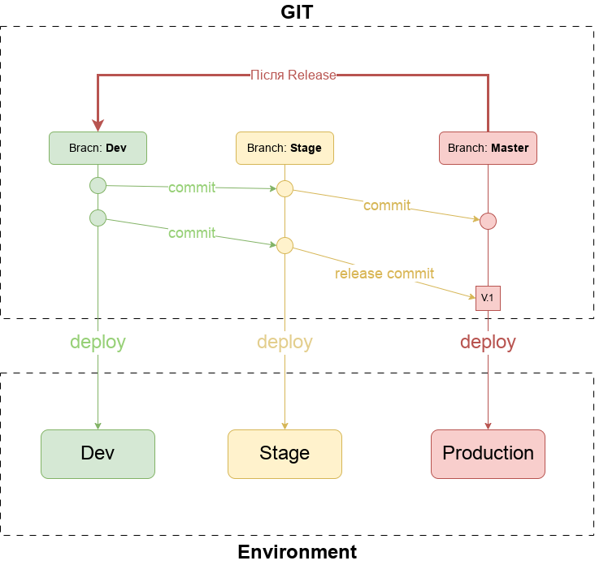

<!-- START doctoc -->
<!-- END doctoc -->

# Мета проекту

Мені, як Devops спеціалісту, було потрібно вдосконалити наступні навички:

- Вивчення підходів та інструментів для автоматичного створення документації по інфраструктурі. Максимально автоматизувати цей процес.

- Підібрати баланс кількість/якість/розуміння по тому як подавати інформацію про інфраструктуру та CI/CD

- Робота с Docker, збирання образів

- Робота з on-line сервісом GitLab:
  - GitLab CI/CD, gitlab-runner
  - GitLab private Docker registry
  - GitLab Terraform state files registry
  - інтегрування з кластерами Kubernetes
  
- Робота з Ansible

- Робота з Terraform

- Робота з хмарними сервісами AWS: EKS, Route53,  VPC, IAM, ALB, EC2, 

- Створення на базі *bare-metal* серверів та гіпервізору **Proxmox VE** інфраструктури для хостингу Kubernetes

  

# Подальші плани

- AWS Cloud Watch, AWS Cloud Trail

- Google Cloud Platform

- ELK Stack або Loki

- Istio Service Mesh

- Prometheus

- Grafana

- системи **documentation as code** на кшталт Hugo або Docuzaurus

- інтегрування Hashicorp Vault з Gitlab, Rancher, AWS EKS

- Jenkins, JenkinsX

- FluxCD

  

# TODO

- [ ] Додати в terraform `aws_acm_certificate` для https termination сабдоменів
- [ ] Рішення для Ingress EKS:
  - Nginx Ingress + External DNS 
  - AWS Application Load Balancer
  - AWS Application Load Balancer + External DNS 
- [ ] Додати в EKS Kubernetes Extentions
- [ ] Persistent Volume Claim в AWS EKS
- [ ] Створити в terraform декілька IAM з різним рівнем для декількох розробників 
- [ ] Доробити CI/CD deploy на production

# Структура директорій

- `./src` – містить вихідні коди мікросервісів проекту
- `./tools` – допоміжні застосунки для проекту
  - Docker файли для утиліт, які можуть використовуватись на комп\`ютері розробника в docker compose
  - bash-скрипти для автоматичного парсінгу та створення документації - `ansible-autodoc`, `terraform-docs`, `merge-markdown`
  - рендерінг jinja2-templates за допомогою `jinja2-renderer`
- `./ci` – містить yaml-файли, які використовуються в `.gitlab-ci.yml`. Кожен файл відповідає за окремий сервіс. Всі файли мають однакову структуру та генеруються з шаблону
- `.gitlab` – містить налаштування для з\`єднання з кластерами
- `./img` – містить всі зображення, яки використовують в документації
- `./templates` – містить шаблони jinja2 для створення yaml-файлів для `.gitlab-ci.yml` та kubernetes deployment
- `./kubernetes` – містить згенеровані з шаблонів yaml-файли для kubernetes deployment
- `./docs` – містить конфігураційні файли для  `terraform-docs`, `merge-markdown` та для окремих файлів
  документації, які не генеруються автоматично
- `./ansible` – містить ansible-роль для створення кластера Kubernetes за допомогою [Rancher](https://www.rancher.com/)
- `./terraform` – містить ресурси Terraform для створення AWS EKS  

# Вихідний код

Основою цього тестового проекту є досить вдалий код від Google (він дійсно працює) — [Online Boutique](https://github.com/GoogleCloudPlatform/microservices-demo). Це "хмарний" веб-додаток для електронної комерції, де користувачі можуть переглядати товари, додавати їх у кошик та купувати. Online Boutique складається з 11 мікросервісів, які створені на різних мовах програмування.   

| Мікросервіс                                                 | Мова програмування | Опис                                                         |
| ----------------------------------------------------------- | ------------------ | ------------------------------------------------------------ |
| **frontend:**  ./src/frontend                          | Go                 | HTTP-сервер для обслуговування веб-сайту. Не потребує реєстрації/входу та автоматично генерує ідентифікатори сеансу для всіх користувачів. |
| **cartservice:** ./src/cartservice                     | C#                 | Зберігає товари в кошику користувача в Redis і отримує їх.   |
| **productcatalogservice:** ./src/productcatalogservice | Go                 | Надає список продуктів із файлу JSON і можливість пошуку продуктів і отримання окремих продуктів. |
| **currencyservice:** ./src/currencyservice             | Node.js            | Конвертує одну грошову суму в іншу валюту. Використовує реальні значення, отримані від Європейського центрального банку. |
| **paymentservice:** ./src/paymentservice               | Node.js            | Стягує з указаної інформації кредитної картки (фіктивну) вказану суму та повертає ідентифікатор транзакції. |
| **shippingservice:** ./src/shippingservice             | Go                 | Дає оцінку вартості доставки на основі кошика для покупок. Відправляє товари за вказаною адресою (імітація) |
| **emailservice** – ./src/emailservice                       | Python             | Надсилає користувачам електронний лист із підтвердженням замовлення (макет). |
| **checkoutservice:** ./src/checkoutservice             | Go                 | Отримує кошик користувача, готує замовлення та організовує оплату, доставку та сповіщення електронною поштою. |
| **recommendationservice:** ./src/recommendationservice | Python             | Рекомендує інші продукти на основі того, що надано в кошику. |
| **adservice:** ./src/adservice                         | Java               | Надає текстові оголошення на основі заданих контекстних слів. |
| **loadgenerator:** ./src/loadgenerator                 | Python/Locust      | Постійно надсилає запити, що імітують реалістичні потоки покупок користувачів, до інтерфейсу. |

# Програмні засоби

| Назва                  | Для чого використовувався                                    |
| ---------------------- | ------------------------------------------------------------ |
| Docker, Docker Compose | Складання образів Docker, запуск декількох образів в одному робочому процесі |
| Сервіс GitLab.com      | Хостинг програмного коду, хостинг приватного реєстру docker, deploy контейнерів в Kubernetes, хостинг Terraform state, Ci/CD з допомогою gitlab-runner |
| Ansible                | Автоматичне розгортання **Rancher** на віртуальних машинах   |
| Terraform              | Створення кластера EKS на AWS, та супутніх сервісів – Route53, ELB, KMS, VPC |
| Proxmox VE             | Створення на bare-metal інфраструктури для Stage (UAT)       |
| Rancher (RKE1)         | Розгортання та адміністрування Kubernetes на віртуальних машинах. [Документація](https://rancher.com/docs/rke/latest/en/) |
| merge-markdown         | Автоматична компіляція html сайту, та Readme.md з документацією по всім розділам. [Документація](https://github.com/knennigtri/merge-markdown). |
| ansible-autodoc        | Автоматичне створення документації з коментарів коду Ansible role. [Документація](https://github.com/AndresBott/ansible-autodoc) |
| terraform-docs         | Автоматичне створення документації з коментарів коду Terraform файлів. [Документація](https://terraform-docs.io/user-guide/introduction/) |
| jinja2-render          | Створює файли за допомогою jinja2-templates. [Документація](https://github.com/pklaus/jinja2-render) |
| detect-secrets         | Шукає файли з sensitive content у файлах проекту. [Документація](https://github.com/Yelp/detect-secrets) |
| pluralith              | Візуалізує інфраструктуру aws із файлу terraform.state ( не зовсім корисний але допомагає бачити масштаб ). [Документація](https://docs.pluralith.com/) |

# Модель процесу розробки

Структуру розробки можна поділити на три складові:

1. Програмний код, який супроводжується розробниками
2. Створення Docker-образів з програмного коду, хостинг образів в приватному реєстрі Docker
3. Запуск та оркестрування контейнерів на базі цих образів

Для ускладнення проекту програмний код всіх мікросервісів був об'єднаний в monorepo, у вигляді `./src/{microservice-name}`

# Git Flow

Використовується схема [**gitlab-flow**](https://docs.gitlab.com/ee/topics/gitlab_flow.html):

1. **Dev** – основна гілка розробки.
2. **Stage** – гілка для тестування (UAT – User Acceptible Testing)
3. **Production** – гілка, на основі якої працює продуктивне середовище
