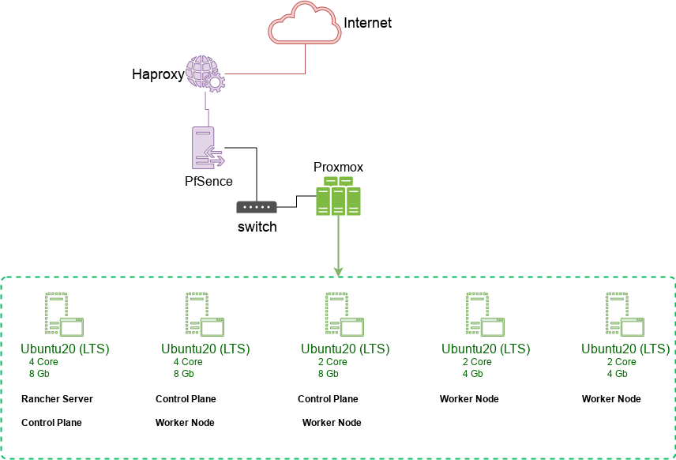

# Середовище Stage

В моєму випадку використовувались 5 віртуальних машин: 2 ядра CPU, 4-8 Gb оперативної пам'яті, Ubuntu 20 LTS. Зовнішній
доступ — фіксований зовнішній IP, віртуальна машина з PFSense + Haproxy.

На базі **Rancher** був розгорнутий кластер Kubernetes з окремим `project`  та`namespace` для цього проекту. Також було підключено приватний реєстр GitLab для образів Docker. 

Зовнішній трафік був спрямований на **PFSense** + **Haproxy** з використанням Letsencrypt для SSL-termination, далі він пересилався на `NodeIP` кластера Kubernetes

